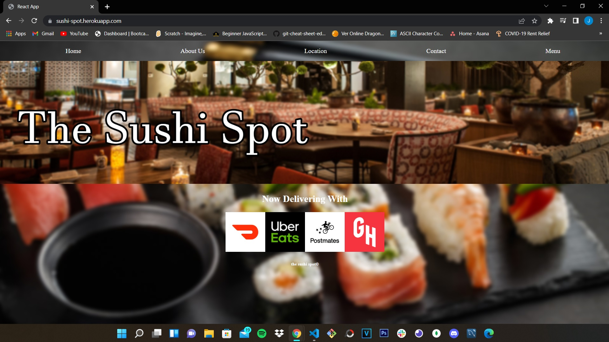

# The Sushi Spot

The Sushi Spot is a great restaurant website for the client to navigate to, with 
easy and straight forward options to satisfy the client's needs. This website gives
options through the Nav for a home page that displays delivery options for when the client
wants to satisfy their hunger at home, an about us to provide the client more information 
on the origins and history of the restaurant, a location to Dine in areas in Orange County CA,
a Contact to be able to message the owner directly regarding any type concern the client has,
and a Menu to provide the client with the plates available.

This website was created using React.js for a faster loading time for a better
user experience and for a better front-end tool when it comes to modification and
development of the website.

This app has been pushed to heroku nad has been fully tested for responsiveness,
here is a screenshot of the website running and a link to test the website yourself.

https://sushi-spot.herokuapp.com/

Also, I leave here a link to the repository in github 
https://github.com/codesforjenuel/sushirestaurant